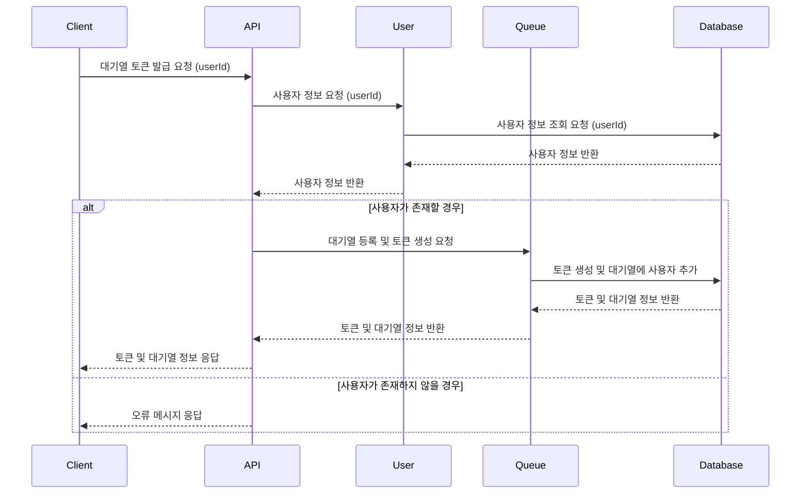
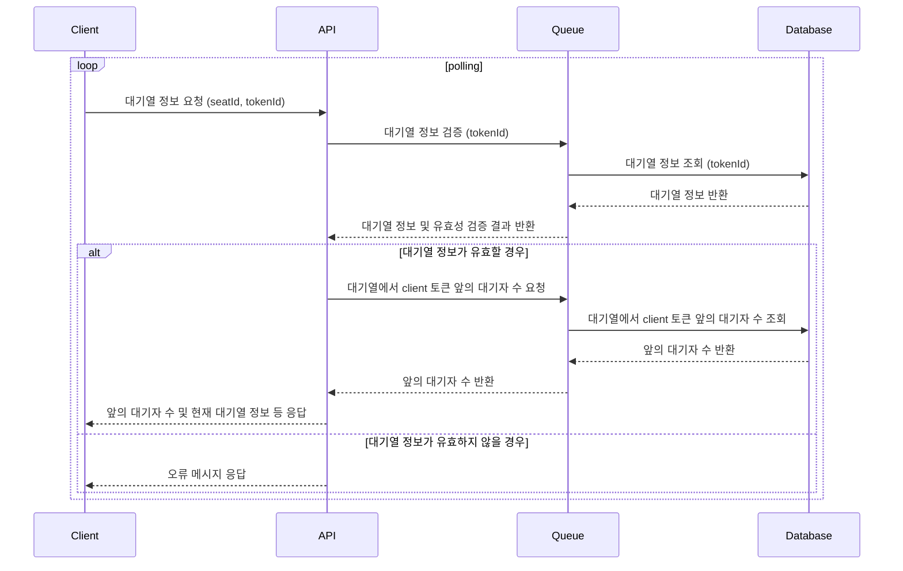
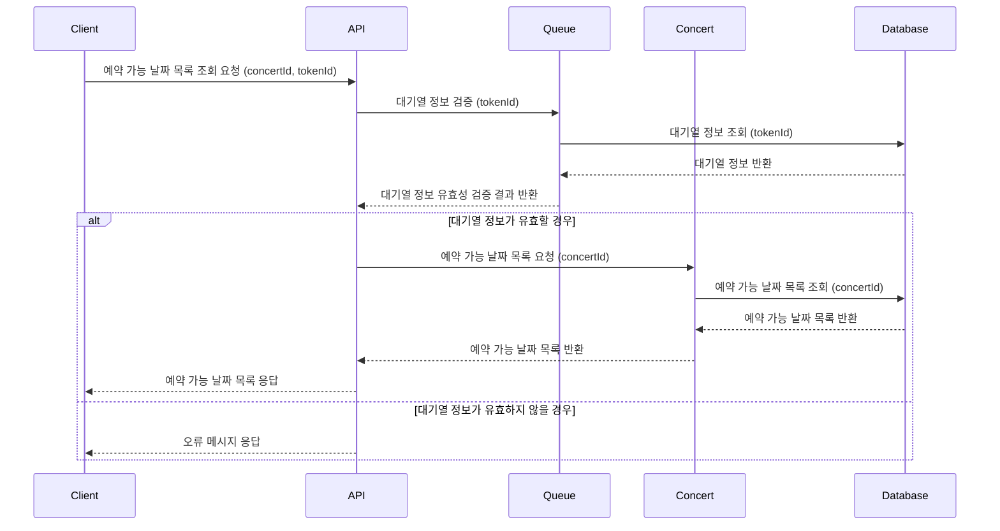
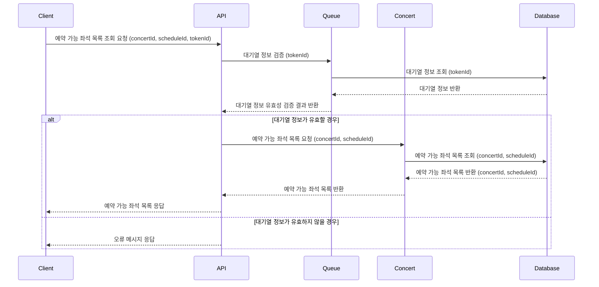
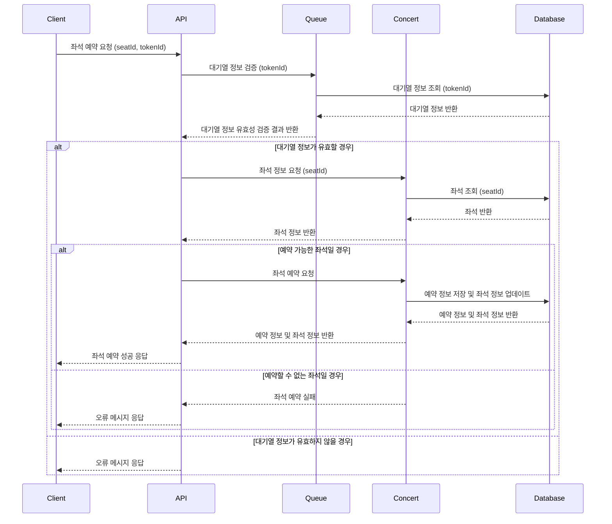
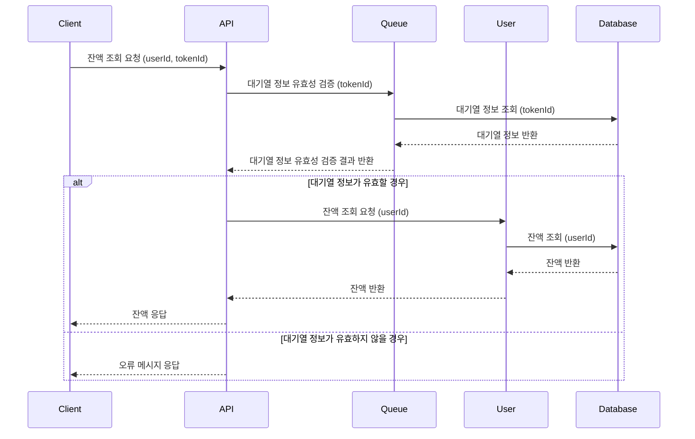
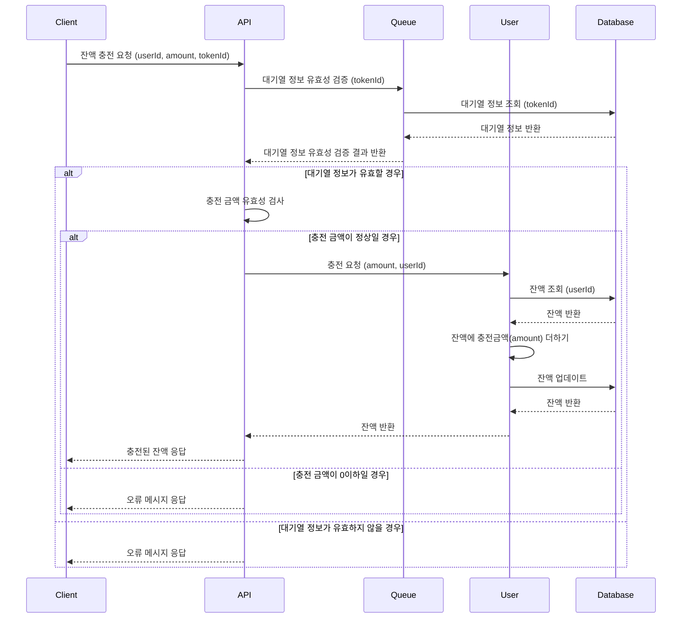
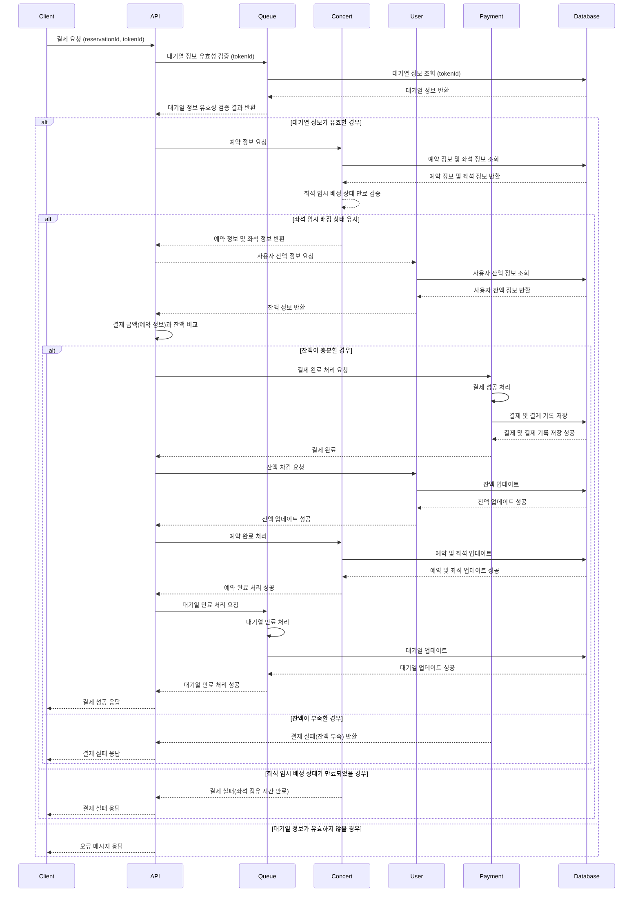

# Sequence Diagram
 

## 1. 사용자 대기열 토큰 발급
### 1-1. sequence diagram

### 1-2. Description
todo
 

## 2. 사용자 대기열 관련 polling
### 2-1. sequence diagram

### 2-2. description
todo
 

## 3. 예약 가능 날짜 조회
### 3-1. sequence diagram

### 3-2. description
todo
 

## 4. 예약 가능 좌석 조회
### 4-1. sequence diagram

### 4-2. description
todo
 

## 5. 좌석 예약 요청
### 5-1. sequence diagram

### 5-2. description
todo
 

## 6. 잔액 조회
### 6-1. sequence diagram

### 6-2. description
todo
 

## 7. 잔액 충전
### 7-1. sequence diagram

### 7-2. description
todo
 

## 8. 결제
### 8-1. sequence diagram

### 8-2. description
todo
 