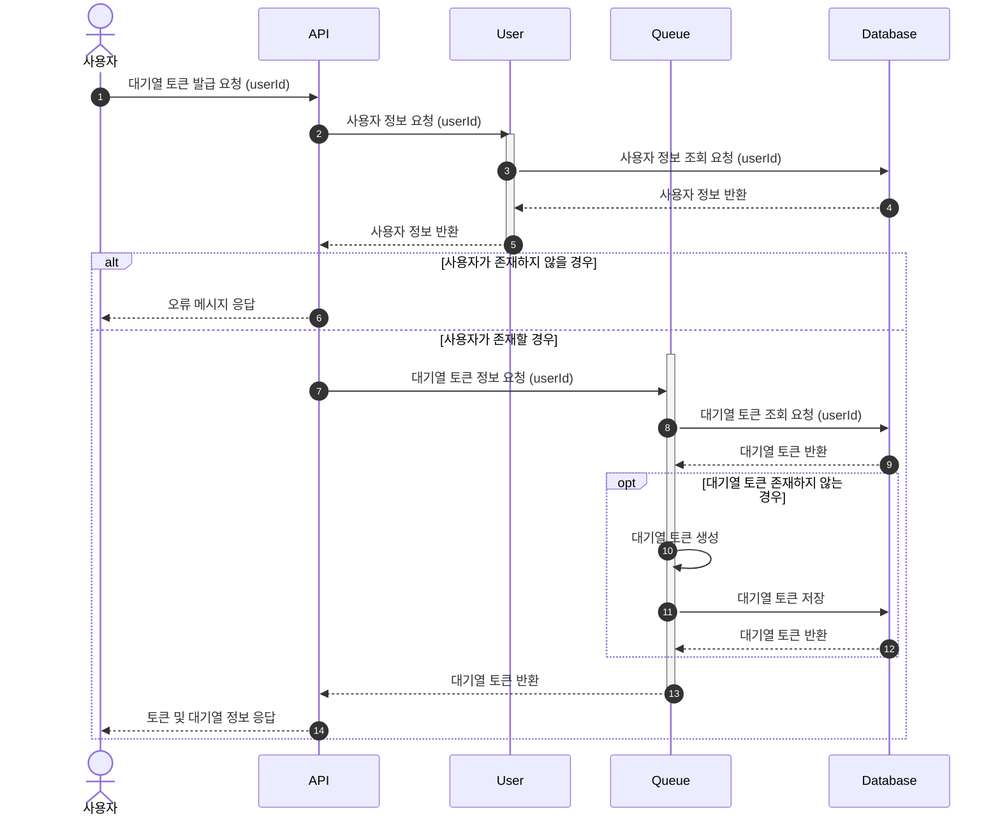
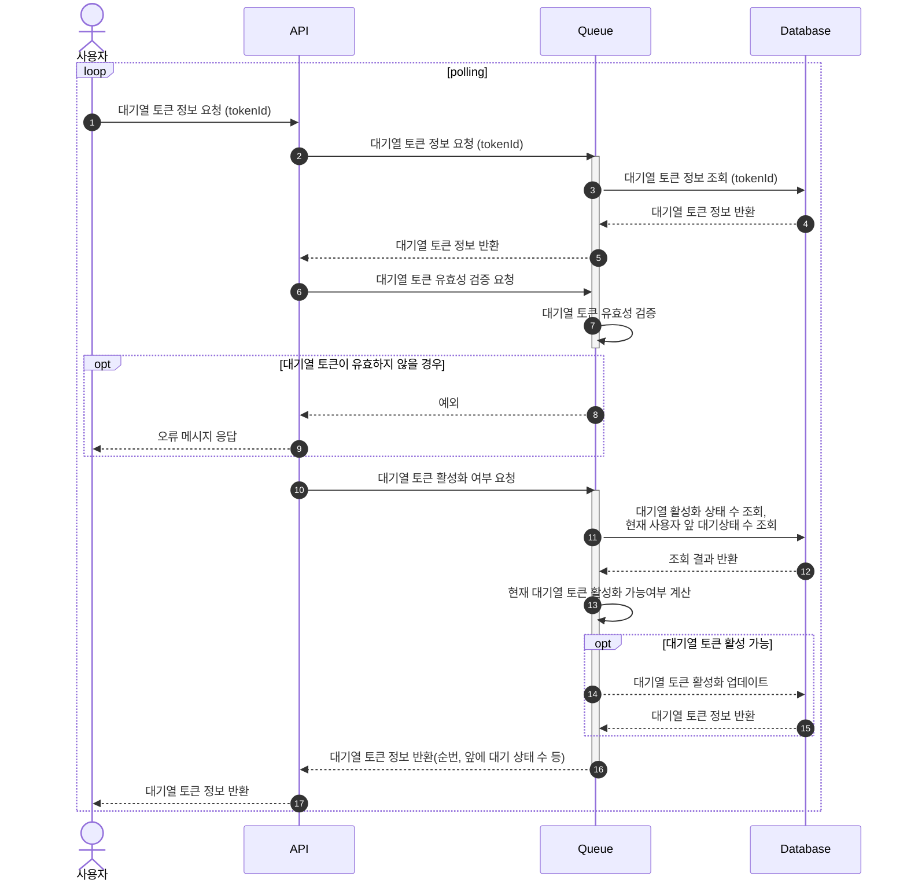
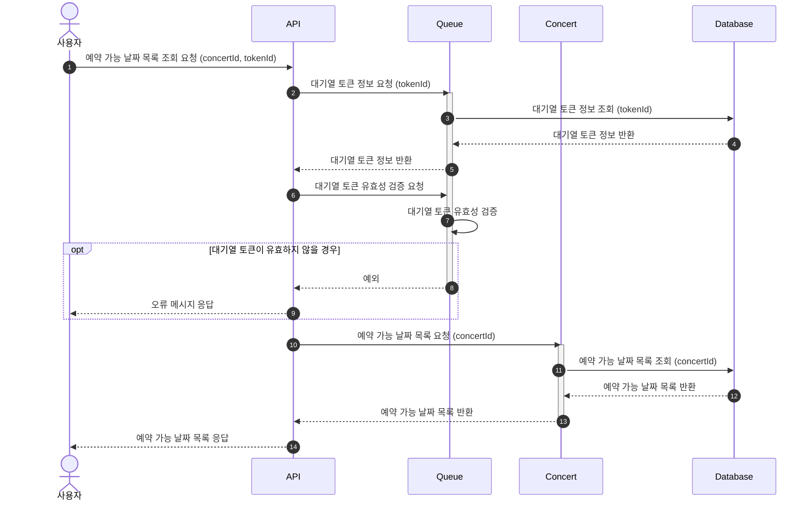
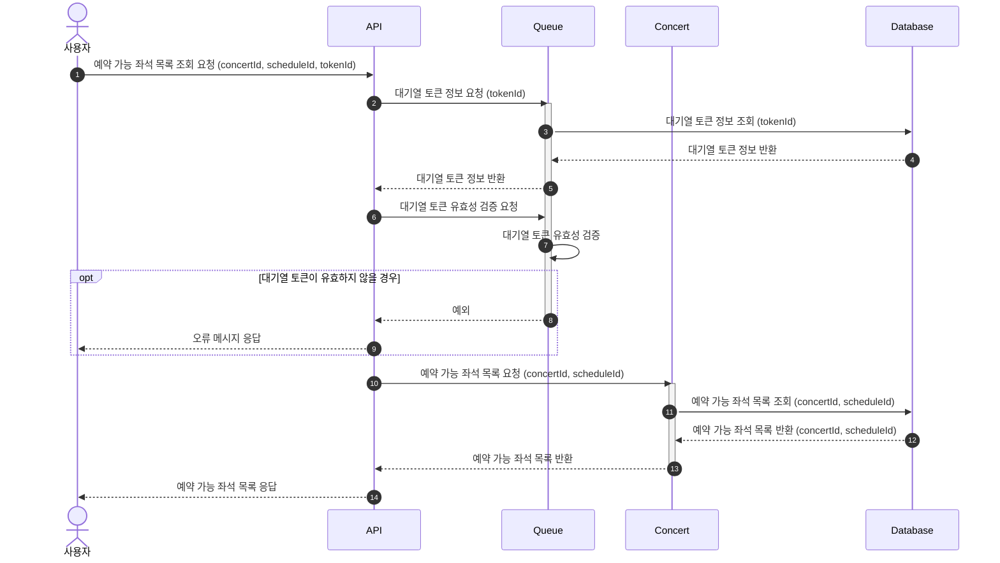
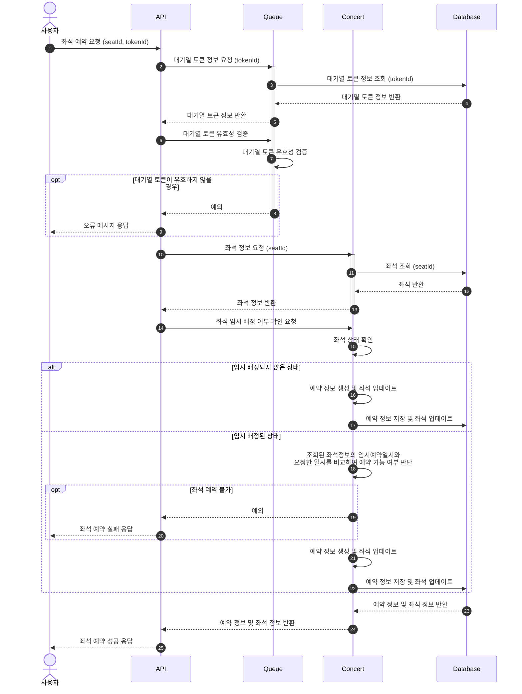
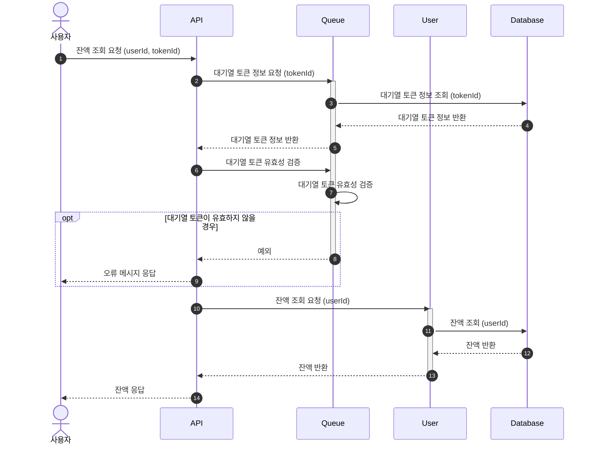
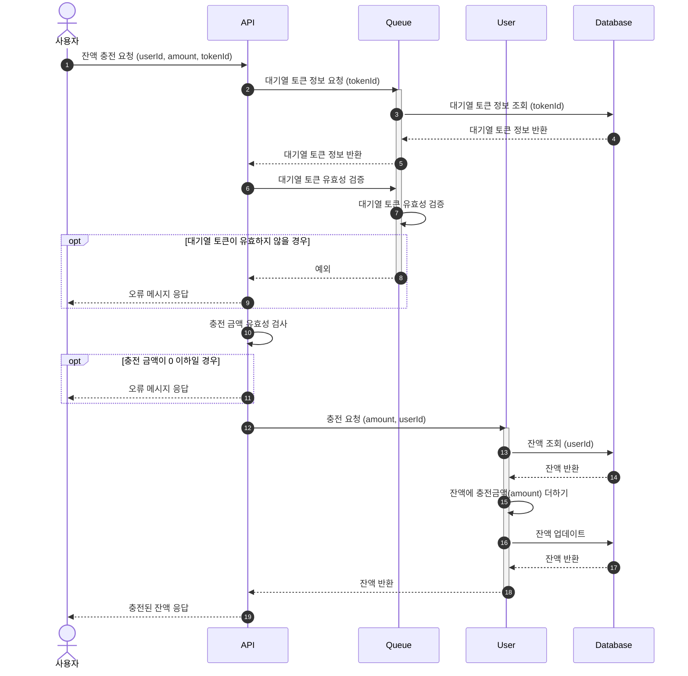
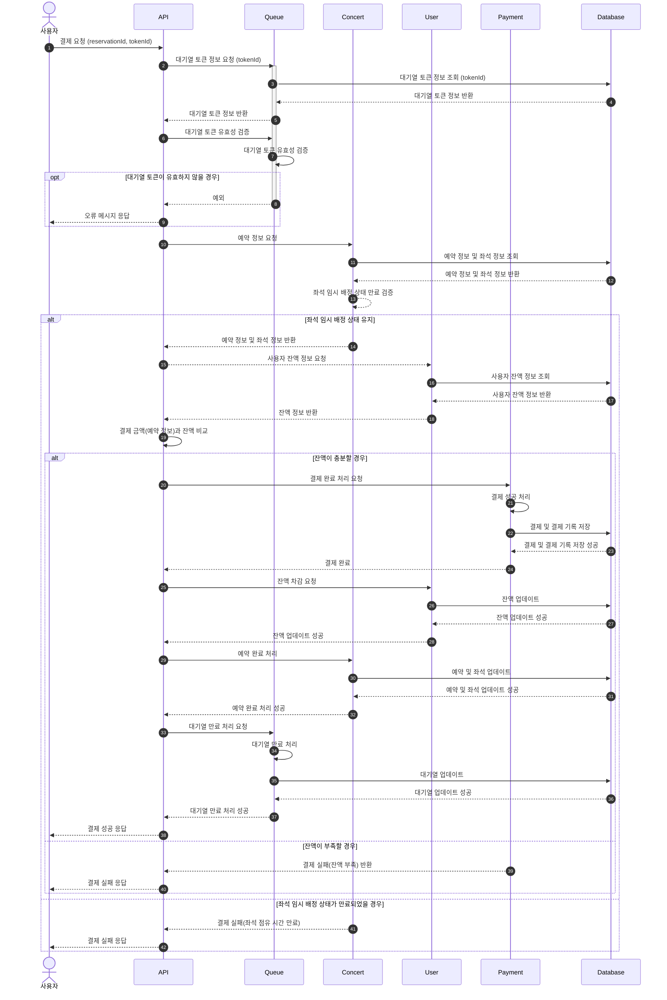

# Sequence Diagram
 

## 0. 도메인 정의
- User
  - 사용자 정보
  - 사용자 잔액 정보
- Queue
  - 대기열 정보 (토큰)
- Concert
  - 콘서트 정보
  - 콘서트 스케줄 정보
  - 콘서트 좌석 정보
  - 콘서트 예약 정보
- Payment
  - 결제 정보

## 1. 사용자 대기열 토큰 발급

 

## 2. 사용자 대기열 관련 polling

 

## 3. 예약 가능 날짜 조회

 

## 4. 예약 가능 좌석 조회
### 4-1. sequence diagram

 

## 5. 좌석 예약 요청

 

## 6. 잔액 조회

 

## 7. 잔액 충전

 

## 8. 결제

 